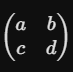

# Matriisit
#### Matriisin alkiot ovat kokonaislukuja -20 - 20
### Ensinmäinen tehtävä
Tehtävänä on toteuttaa funktio valitsemallasi kielellä, joka laskee 2x2 matriisiin determinantin
Kieleksi valitsin c++.
#### Funktion rakentaminen
Aloitetaan tuomalla tarvittavat kirjastot, kuten iostream ja array. Ohjelman voisi tehdä myös pelkällä iostreamillä, mutta se on yksinkertaisempi arrayllä.
Matriisin arvot sijoittuvat seuraavasti:
    

Determinantin lasku kaava on seuraavanlainen:
```math
    (a * d) - (b * c)
```
Rakennetaan laskeMatrix funktio:
    
int määrittää funktion palautuvaksi arvoksi kokonaisluvun, tällöin determinantin tulos palautuu kokonaislukuna.

``` std::array<std::array<int, 2>, 2> ```
Edustaa 2x2matriisia ```&``` Estää matriisin turhan kopioinnin muistissa, mikä tehostaa koodin suoritus kykyä. ```const``` estää laskemisen aikana funktion suorituksen aikana vahinko muutosta.

2D taulukosta haetaan alkioita syntaxilla ```m[rivi][sarake]``` 

* ```m[0][0]``` edustaa arvoa a
* ```m[1][1]``` edustaa arvoa d
* ```m[0][1]``` edustaa arvoa b
* ```m[1][0]``` edustaa arvoa c

Laskutoimitus ja tuloksen palautus
```(m[0][0] * m[1][1])``` kertoo päälävistäjän alkiot keskenään.
```(m[0][1] * ,[1][0])``` Kertoo sivulävistäjän alkiot.
Miinus merkki vähentää päälävistäjän ja sivulävistäjän jonka jälkeen ```return``` palauttaa funktion kutsujalle.

Rakennetaan main funktio: 
```std::array<std::array<int, 2> matrix =```
Alustaa matriisin mihin on luvut valmiiksi sijoitettu.
```int det = laskeMatrix(matrix);``` kutsuu aiemmin luodun funktion ja välittää sille juuri alustetun ```matrixin```.
funktio laskee matriisin ja palauttaa vastaukseksi determinantin.

#### Ohjelman kehittäminen käytännöllisemmäksi

Voidaan kehittää ohjelmaa siten, että ohjelma kysyy käyttäjältä arvot matriisiin, mutta rajana ovat ```-20``` ja ```20```.
Tein uuden funktion nimeltä ```kysyArvo```, joka kysyy käyttäjältä 4 kertaa arvoja ```-20``` ja ```20``` väliltä ja tarkistaa ovatko arvot rajapintojen sisällä hyödyntäen while looppia.
Lisättiin main funktioon neljä apufunktiota ```int x = kysyArvo('x')``` jolloinka kaikki sujuu ongelmitta.

```std::array<std::array<int, 2>, 2> matrix = {{{a, b}, {c, d}}};``` 
### Toinen tehtävä
Toisena tehtävänä on tehdä funktio joka laskee 2x2 matriisin käänteismatriisin Craamerin säännön avulla.